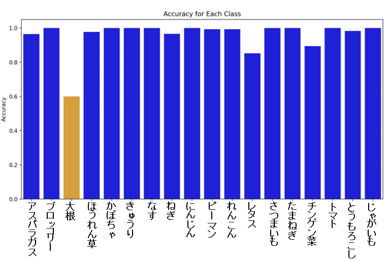
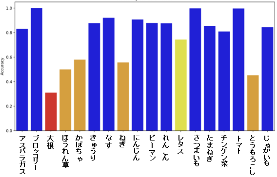
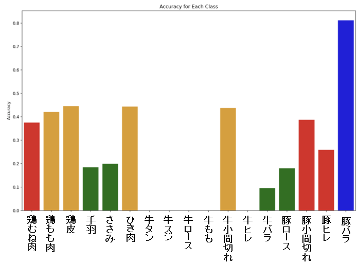

# 画像判定精度（記録）
## 野菜のみのモデル精度
### ・野菜カテゴリー17種類に対しての精度（パッケージを含まない画像でのテスト）
- 総合精度：94.7%

  ほぼ完璧にクラス分けを行うことができる。
  

### ・野菜カテゴリー17種類に対しての精度（パッケージを含む画像でのテスト）
- 総合精度：78.2%

  特定クラスの精度が落ちた

## 肉のみのモデル精度
### ・肉カテゴリー17種類に対しての精度
- 総合精度：24.2%

画像だけで食材を判断することは不可能である数値である。
  

### 💡解決策
- 肉の場合は、文字認識を使い食材パッケージのラベルの文字を読み取り食材を判定する方法を用いる
